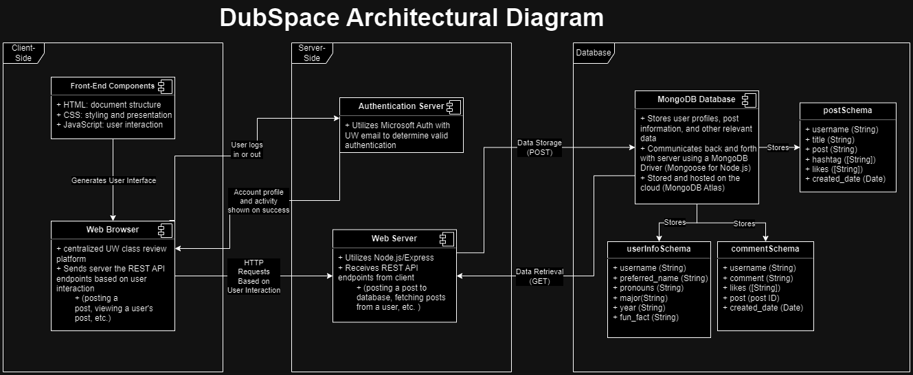

# Group 6 - DubSpace
***Members: Ken Huang, Nic Chin, Benny Po***

Deployed Website: https://dubspace.azurewebsites.net (isn't up right now due to being ran on previous quarter's azure credits)

## Project Description
In this project, our target audience is mostly UW students. We envision that students who are looking to get other students’ opinions on classes they are interested in taking, and gain additional insight into the class from students who have previously taken the class will find our application useful. Students who wish to share their experience on a course they took will also likely have an interest in using our application.

Our audience may want to use our application, as it acts like a central repository or resource where students can easily access and view information about different classes. For instance, instead of going to various individual sites like Reddit, RateMyProfessors, and question sites like Quora, students can just visit this app to get all that information in one place.

As fellow UW students, we are the ones taking the classes and looking all over the internet for reviews on the curriculum, courseload, the professor, and other general criticisms. It takes time for a user to look through all the different sites that may host this information, and for some classes and professors, they might not even have this information stored yet. Making a centralized platform for class reviews at UW will immensely help users researching and looking for classes to take. As developers, we want to be able to help UW students save their time, and a single platform like this will enable that.

## Technical Description

## User Stories
Priority | User | Description | Technical Implementation
--- | --- | --- | ---
P0 | Student | I want to be able to login to an account using my uw email. | Implement an user authorization/login system using Microsoft auth. Have client side code that allows users to view posts and view an account tab. Use Node.js server to handle authentication and authorization Then have a mongoDB database of a user’s posts.
P0 | Student | I want to post reviews about classes I have taken in the past. | Create an endpoint on Node.js server to handle review posts. Allow users to input details such as class name, professor and review comments. Store the review data in a MongoDB database and associate it with the user’s profile.
P0 | Student | I want to be able to read reviews from other students about classes I am potentially interested in taking. | Implement an endpoint to fetch class reviews based on the user request. Allow users to view reviews for the class they want and fetch data from the MongoDB database and send it to the client side code for display.
P1 | Student | I want to be able to have a user profile. | Upon successful authentication, create a user profile in a MongoDB user database. Include fields such as username, email and other relevant information.
P1 | Student | I want to be able to leave a like on a post. | Add a likes field to MongoDB schema for class reviews and create an endpoint on node js. Allow users to view how many likes a post has on the client side.
P1 | Student | I want to be able to comment on posts. | Create an endpoint on Node.js server to handle comment posts. Allow users to fill out commnets and store this data in a MongoDB database and associate it with the user's profile.
P1 | Student | I want to be able to search for particular posts. | Implement an endpoint to fetch posts based on the user query.
P1 | Student | I want to be able to search for categorized posts. | Implement an endpoint to fetch posts based on the post hashtags.
P2 | Course Administrator | I want to be able to leave a short description about my course for potential students. | Extend MongoDB schema to allow for a course description field. Create a new endpoint on Node.js server and add client side code to display the descriptions.

\
***User Stories Not Implemented:***
Priority | User | Description | Technical Implementation
--- | --- | --- | ---
P1 | Student | I want to be able to leave a rating (0 to 5 stars) on how I felt overall about a class. | Add a rating field to MongoDB schema for class reviews and create an endpoint on node js. Allow users to include a rating along with the reviews and run it through an average rating calculation function.
P2 | Student | I want to be able to like posts and view top rated posts or filter by the amount of likes a post has. | Add a likes field to MongoDB schema and create an api endpoint for likes on node js server. Then add a frontend icon that displays a button to like a post and a number that displays number of likes.
P3 | Student | I want to be able to view the top internet searches for specific queries. | Access various website’s REST API endpoints to gather the most relevant posts/articles (Reddit, etc.).
P3 | Student | I want to be able to friend or follow other user profiles. | Add to the user profile mongoDB schema to add a friends or followers field. Create an API endpoint for friends and following with routes for sending/accepting follow requests.

##  Endpoints
- Authentication/Users
  - Endpoint: `/signin`
    - Description: Handle user sign in through Azure.
  - Endpoint: `/signout`
    - Description: Delete current user session and signs the user out.
  - Endpoint: `/users/myIdentity`
    - Description: Checks to see if a user is logged in.
- Posts
  - Endpoint: `/posts`
    - Description: Retrieves all posts.
    - Request Type: `GET`
    - Response Type: JSON
  - Endpoint: `/posts`
    - Description: Adds a new entry to the post table.
    - Request Type: `POST`
    - Response Type: JSON
  - Endpoint: `/posts?search=`
    - Description: If search parameter is included, provide all of the posts matching the term passed in the search query parameter.
    - Request Type: `GET`
    - Response Type: JSON
  - Endpoint: `/posts?tag=`
    - Description: If tag parameter is included, provide all of the posts matching the term passed in the tag query parameter.
    - Request Type: `GET`
    - Response Type: JSON
  - Endpoint: `/posts?username=`
    - Description: If username parameter is included, provide all of the posts matching the term passed in the username query parameter.
    - Request Type: `GET`
    - Response Type: JSON
  - Endpoint: `/posts/like`
    - Description: Increment the current value of likes of the given post by 1 and respond with the new value.
    - Request Type: `POST`
    - Response Type: JSON
  - Endpoint: `/posts/unlike`
    - Description: Decrements the current value of likes of the given post by 1 and respond with the new value.
    - Request Type: `POST`
    - Response Type: JSON
  - Endpoint: `/posts/:id`
    - Description: Retrieves the post with the given ID.
    - Request Type: `GET`
    - Response Type: JSON
- Comments
  - Endpoint: `/comments`
    - Description: Retrieves all comments.
    - Request Type: `GET`
    - Response Type: JSON
  - Endpoint: `/comments`
    - Description: Adds a new entry to the comments table.
    - Request Type: `POST`
    - Response Type: JSON
  - Endpoint: `/comments?postID=`
    - Description: If postID parameter is included, provide all of the comments matching the term passed in the postID query parameter.
    - Request Type: `GET`
    - Response Type: JSON
- User Information
  - Endpoint: `/userInfo`
    - Description: Retrieves all user information.
    - Request Type: `GET`
    - Response Type: JSON
  - Endpoint: `/userInfo`
    - Description: Adds a new entry to the user information table.
    - Request Type: `POST`
    - Response Type: JSON
  - Endpoint: `/userInfo?username=`
    - Description: If username parameter is included, provide all of the user information matching the term passed in the username query parameter.
    - Request Type: `GET`
    - Response Type: JSON

## Data Schemas
- postSchema
  - username
  - title
  - post
  - hashtag
  - likes
  - created_date

- commentSchema
  - username
  - comment
  - likes
  - post
  - created_date

- userInfoSchema
  - username
  - preferred_name
  - pronouns
  - major
  - year
  - fun_fact
